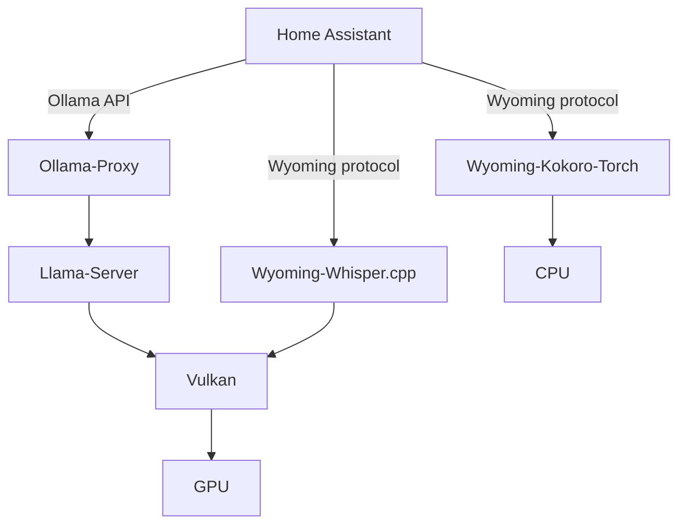

This repository hosts a couple files useful to run a Voice Assistant on Home Assistant backed by Vulkan API.

In a nutshell, we integrate the whole system as following:



* *[Llama-Server](https://github.com/ggml-org/llama.cpp)* runs the LLM to generate responses and call tools.
* *[Ollama-proxy](https://github.com/debackerl/ollama-proxy/)* exposes Llama-Server using the same API as Ollama. This is required because Home Assistant doesn't let users change the base URL of their OpenAPI or OpenRouter integrations. Only the Ollama integration lets you do it. Ollama-proxy implements streaming, tools, and reasoning (however, I couldn't get Home Assistant to give back past reasoning traces yet). It doesn't support multi-modal (images) yet.
* *[Wyoming-Whisper.cpp](https://github.com/debackerl/wyoming-whisper.cpp/)* implements ASR (Automatic Speech Recognition) using Whisper.cpp. Home Assistant offers Wyoming-Faster-Whisper already, but it doesn't run on Vulkan.
* *[Wyoming-Kokoro-Torch](https://github.com/debackerl/wyoming-kokoro-torch)* It implements the TTS (Text-to-Speech) using Kokoro. It's fast enough to run on a CPU, but you can build your own Docker image to add CUDA or ROCm runtime. As of the time of writing, contrary to [kokoro-wyoming](https://github.com/nordwestt/kokoro-wyoming), Wyoming-Kokoro-Torch supports streaming move, so that your voice assistant will start speaking before the LLM is fully done generating a response.

Llama-Server and Wyoming-Whisper.cpp never run at the same time. The ASR always runs first obvisouly, and the whole decoded text will then be fed to the LLM. However, Llama-Server and Wyoming-Piper run concurrently, since the TTS will generate audio while the LLM is generating text.

## Why Vulkan?

1. It's vendor-agnostic, most (all?) GPUs drivers will implement it.
2. The library is generally compact, my container for Radeon is 500 MiB intead of 10+ GiB if I used ROCm.
3. Llama.cpp's implementation on top of Vulkan got as fast, if not faster, than other implementation in spring 2025. See Phoronix's [article](https://www.phoronix.com/review/amd-rocm-7-strix-halo/3).
4. In the case of Radeon, "it just works" using any recent Linux distribution. Some software using ROCm insisted on downloading the DKMS drivers from AMD, which in turn broke the Secure Boot of my system.
5. Ollama doesn't even work nicely on AMD APUs, the community currently needs to use a [fork](https://github.com/rjmalagon/ollama-linux-amd-apu) of Ollama if they whish to use GTT (using "normal" RAM instead of the dedicated VRAM).

## The LLM

GPT OSS 20B is used, but any other LLM supported by Llama.cpp with support for tools can be used. This model is using only 3.6B parameters for each token produced, while using just 12GiB of storage.

## Optimizations

The template of GPT OSS 20B has been hacked to optimize the caching of the prompts. That model starts with an "identity" prompt to tell it what it is, followed by a list of built-in tools, then the system prompt, and finally the tools offered by the user. Because Home Assistant puts the current time at the end of the system prompt, the whole description of tools would have to be reevaluated on each new chat. The hacked template is moving all tools before the system prompt. GPT OSS 20B is still making use of those tools just fine, but it removes about 3 seconds of processing time on my AMD Ryzen AI 9 HX 370 on each new chat.

We use the Q8_0 quantized version of GPT OSS 20B. On the AMD Ryzen AI 9 HX 370, layers quantized in Q8 run faster than F16 or Q4. This speeds up prompt processing by about 10%.

The AMDVLK (user) driver is used since it's still a bit faster than RADV for prompt processing. However, since AMD is now working on RADV instead of AMDVLK, the situation could change.

## Speed

Measured in a Proxmox VM with iGPU passthrough:

| System                | Model              | Prompt Processing (pp512) | Token Generation (tg128) |
|-----------------------|--------------------|---------------------------|--------------------------|
| AMD Ryzen AI 9 HX 370 | GPT OSS 20B (Q8_0) | 550                       | 25                       |

You may also this [Llama.cpp Backend Performance Comparison](https://kyuz0.github.io/amd-strix-halo-toolboxes/) page, to see the "optimal" librairies to run each LLM on an AMD Ryzen AI MAX+ 395. Again, this is a moving target. The best solution could change over time as software is being optimized.

## Containers

All applications needed to turn Home Assistant in to a digital assistant have been containerized. The Dockerfiles to build the images below are included in this repository. This makes it easier to manage the dependencies of each application, and deploy them. If you don't want to install containers, both wyoming applications can be installed from PyPi, ollama-proxy can be installed via [`go install`](https://manpages.debian.org/unstable/golang-go/go-install.1.en.html), while llama-server can be obtained from downloaded their [releases](https://github.com/ggml-org/llama.cpp/releases) page.

Here is a list of all images, and their size.

| REPOSITORY                        | TAG                       | IMAGE ID       | SIZE (on disk) |
|-----------------------------------|---------------------------|----------------|----------------|
| debackerl/llama-server-vulkan     | b6432-amdvlk-2025.q2.1    | e327b4e19a86   | 443MB          |
| debackerl/ollama-proxy            | be8a17e                   | 6b4581e24a1e   | 28.6MB         |
| debackerl/wyoming-whisper.cpp     | v2.6.1-amdvlk-2025.q2.1   | c7e392c9cea2   | 541MB          |
| debackerl/wyoming-kokoro-torch    | v3.1.0-cpu                | 55d974f6baf2   | 1.53GB         |

Example to create the containers:

```sh
docker create --name llama-server --device /dev/dri -p 0.0.0.0:8086:8080 -v /home/XXX/models:/models debackerl/llama-server-vulkan:b6432-amdvlk-2025.q2.1 /app/llama-server -fa 1 --jinja --alias llama-server -c 65536 -np 2 -b 1024 -ub 1024 -m /models/language/gpt-oss-20b-Q8_0.gguf --chat-template-file /models/language/gpt-oss-20b-optimized.jinja --chat-template-kwargs "{\"reasoning_effort\":\"low\",\"model_identity\":\"You are a helpful digital assistant, based on the GPT-OSS 20B model by OpenAI.\"}"

docker create --name ollama-proxy -p 0.0.0.0:11434:11434 debackerl/ollama-proxy:be8a17e /bin/ollama-proxy http://assistant.lan.etive.com:8086/v1/ open

docker create --name wyoming-whisper-cpp --device /dev/dri -p 0.0.0.0:10210:10000 -v /home/XXX/models:/models debackerl/wyoming-whisper.cpp:v2.6.1-amdvlk-2025.q2.1 /usr/local/bin/wyoming-whisper-cpp --uri tcp://0.0.0.0:10000 --model large-v3-turbo-q8_0 --data-dir /models --language en --beam-size 2

docker create --name wyoming-kokoro-torch -p 0.0.0.0:10500:10210 -v /home/XXX/models:/models debackerl/wyoming-kokoro-torch:v3.1.0-cpu /usr/local/bin/wyoming-kokoro-torch --debug --streaming --uri tcp://0.0.0.0:10210 --voice af_sky --data-dir /models
```

*Tip*: if you love killer robots coming from the future speaking with an Austrian accent, you may love the `am_onyx` voice in kokoro.

## Models

Most of those containers will require models to be downloaded in the `/home/XXX/models` directory.

### LLM for llama-server

- https://huggingface.co/unsloth/gpt-oss-20b-GGUF/blob/main/gpt-oss-20b-Q8_0.gguf

### ASR for wyoming-whisper.cpp

Auto-downloaded

### TTS for wyoming-kokoro-torch

You need to download the following two files:

- https://huggingface.co/hexgrad/Kokoro-82M/blob/main/kokoro-v1_0.pth
- https://huggingface.co/hexgrad/Kokoro-82M/blob/main/config.json

Voices are automatically downloaded, but you can also download them from https://huggingface.co/hexgrad/Kokoro-82M/tree/main/voices

## Future

Parakeet TDT 0.6B v3 seems like a much faster, and more accurate ASR model than Whisper. It should be adopted when a Vulkan implementation is ready.

Fish Speech 1.5 has good ratings too, offers more languages, and can sound even more natural, but uses more resources.
